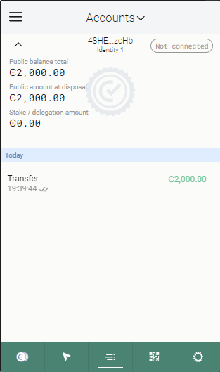
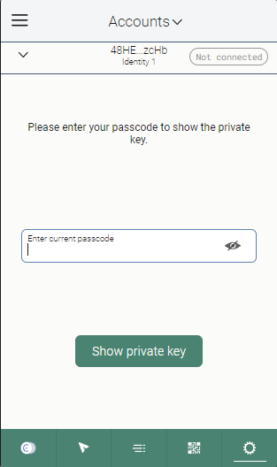

# Concordium Hack TASK 01
##### By Grigore-Gabriel Trifan (GregTrifan)
##### Concordium Mainnet adress: ```2xBLr1bosK5NEQJTW9q1GHsmmuDgLrjAAzC8CSUBJc55AwVsw5```
##### Ethereum address: ```0x2BA30F26B0D163cDFEEA21B9eaC8f82f1Afaa021```
**!!! The address filled on Gitcoin is the Concordium Mainnet one rather than an ERC-20 address**
* Install Rust
  
  
  * Install Wasm toolset
  
  
* cargo-concordium config
    
* Web Wallet config
    * Create account (Address ```48HEZQ7wZU2S1fenyQzt9Ms5K3R4yMHyUtwUqkoREHsFW7zcHb```)
        
    * Requested 2000 CCD from the Faucet  
    ( txHash: ```04996e4544182f5efe2adabc35c65703660580a7244a02479017b68598622d11``` )
        
    * Export account for concordium-client

        
* concordium-client config
    * installed concordium-client
     
    * added account concordium-client from web wallet
     **exported account data from web wallet**
       
      **imported account to concordium-client**
     
